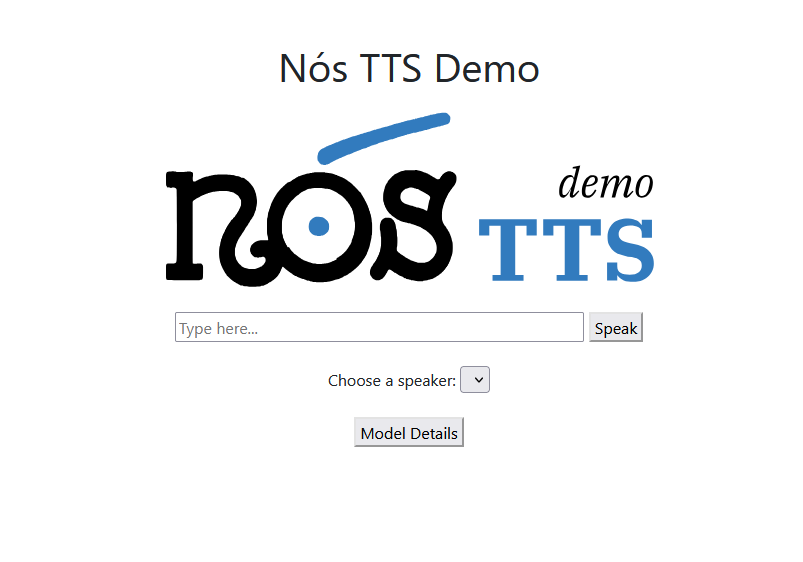

# Text-To-Speech API

This is a simple Text-To-Speech (TTS) REST API based on the 🐸 [Coqui TTS demo server](https://github.com/coqui-ai/TTS/tree/dev/TTS/server).
	
## Demo

A live demo powered by this API showcasing various Galician voices is available at https://tts.nos.gal/.

## Setup

Start by cloning this repository and creating your `models` directory:
```
git clone https://github.com/proxectonos/NOS-TTS-API.git
cd NOS-TTS-API
mkdir models
```

Download your desired models. You can find the Proxecto Nós TTS models on our [Hugging Face repo](https://huggingface.co/collections/proxectonos/tts-models).

Place the downloaded model files (both the model `.pth` and configuration `.json` files) inside the models directory. We recommend organizing each voice into its own subdirectory, as shown in the configuration example below:

```
NOS-TTS-API/
├── models/
│   ├── brais/
│   │   ├── brais.pth
│   │   └── brais_config.json
│   ├── celtia/
│   │   ├── celtia.pth
│   │   └── celtia_config.json
│   └── icia/
│       ├── icia.pth
│       └── icia_config.json
├── config.json
└── ... (other project files)
```

Once your models are in place, you must define their configuration in the `config.json` file (located in the project's root). This file instructs the API on which models to serve and what settings to use for each.

Here is an example `config.json`:

```
{
    "languages":{"gl":"Galician"},
    "models": [
        {
            "voice": "Celtia",
            "lang": "gl", 
            "model_type": "coqui",
            "preprocessor": "cotovia_preprocessor",
            "tts_config_path": "celtia/celtia_config.json",
            "tts_model_path": "celtia/celtia.pth",
            "load": true
        },
        {
            "voice": "Icia",
            "lang": "gl",
            "model_type": "coqui",
	        "preprocessor": "cotovia_preprocessor_tra3",
            "tts_config_path": "icia/icia_config.json",
            "tts_model_path": "icia/icia.pth",
            "load": true 
        },
        {
            "voice": "Brais",
            "lang": "gl",
            "model_type": "coqui",
	        "preprocessor": "cotovia_preprocessor",
            "tts_config_path": "brais/gaspar_grap_config.json",
            "tts_model_path": "brais/gaspar_grap_checkpoint_160000.pth",
            "load": true
        }
    ]
}

```

### Configuration Fields
* `languages`: A dictionary mapping language codes (e.g., "gl") to their full names (e.g., "Galician").

* `models`: A list where each object defines a voice model to be loaded.

    + `voice`: The public-facing name for this voice (e.g., "Celtia").
    + `lang`: The language code for this model. It must match a key in the languages dictionary.
    + `model_type`: The internal identifier for the TTS system (e.g., "coqui").
    + `preprocessor`: The specific text preprocessor to use (e.g., "cotovia_preprocessor").
    + `tts_config_path`: The path to the model's configuration file
    + `tts_model_path`: The path to the model's checkpoint (.pth) file.
    + `load`: Set to true to load this model when the API server starts.

### Paths
The paths in `tts_config_path` and `tts_model_path` can be either absolute or relative.

* If you use relative paths (like in the example), they are resolved from the `models/` **directory**. For instance, `celtia/celtia.pth` points to the file located at `[PROJECT_ROOT]/models/celtia/celtia.pth`.

* If you use absolute paths (e.g., `/home/user/my_models/celtia.pth`), the server will use that exact path.

## Installation

Once you have completed the setup, you can run the server using either Docker (recommended) or a local Python environment.

### Run with docker compose (recommended)

This is the simplest and recommended method. It automatically builds the container, handles all dependencies, and sets up the environment for you.

This will take care of all installations for you.

```
# 1. Build the Docker image
# (Only needed the first time or when you change the configuration)
docker compose build

# 2. Start the server
docker compose up

# (Optional) To run the server in the background (detached mode):
docker compose up -d

# To stop the server:
docker compose down
```

### Run with local installation

This method is for development or if you prefer not to use Docker.

#### 1. (Recommended) Create a Virtual Environment

It is highly recommended to use a Python virtual environment to avoid package conflicts with your other projects.

```
# Create a new virtual environment named 'tts'
python -m venv tts

# Activate the environment
# On macOS/Linux:
source tts/bin/activate
# On Windows:
.\tts\Scripts\activate
```

#### 2. Install Dependencies

Once your environment is active, install the required packages:

```
pip install -r requirements.txt
```

#### 3. Run the Server

You have two ways to run the server:

##### Option A: Manually with Gunicorn

This gives you direct control over the settings.

```
# Run the server on port 5050
gunicorn server:app -b :5050

# You can change the port to any you like (e.g., :8080)
gunicorn server:app -b :8080
```

##### Option B: Using the Helper Script

This is a simple shortcut provided in the repository that runs the gunicorn command for you.

```
./run_local.sh
```

### Using the GPU (Inference)

You can enable GPU acceleration for inference when running locally or with Docker. This requires an NVIDIA GPU and having the NVIDIA Container Toolkit installed for the Docker method.

#### Enabling GPU with Docker

Edit your `docker-compose.yml` file to make two changes:

1. Set the `USE_CUDA` environment variable to `1`.

2. Uncomment the `deploy` block to give the container access to your GPU.

Your file should look like this after editing:

```
...
    environment:
      - USE_CUDA=1
    
    deploy:
      resources:
        reservations:
          devices:
            - driver: nvidia
              count: 1 # Or "all" to use all available GPUs
              capabilities: [gpu]
...
```
Note: For more details on Docker GPU support, see the [official documentation](https://docs.docker.com/compose/how-tos/gpu-support/).

#### Enabling GPU for a Local Installation

This is controlled by setting the `USE_CUDA environment variable to 1 before running the server.`

##### Option A: Using the helper script

If you are using the `run_local.sh` script, simply edit the file and set the variable:

```
# Inside run_local.sh
USE_CUDA=1
...
# (The rest of the script)
```

##### Option B: Manually with Gunicorn

If you are running gunicorn manually, set the variable in your terminal just before running the command:

```
# Set the variable and run the server in one line
USE_CUDA=1 gunicorn server:app -b :5050

```

## API usage

The primary API endpoint for synthesis is `/api/tts`.

It accepts **GET** requests with the following **query parameters**:

* `text`: The text to be synthesized. This text must be URL-encoded (e.g., spaces become `+` or `%20`).

* voice: The name of the voice to use. This must match one of the `voice` names defined in your `config.json`.

**Example with `curl`:**

This command synthesizes the Galician text "Probando a voz de Celtia" using the `Celtia` voice and saves the resulting audio to a file named `celtia.wav`:

```
curl -L -X GET 'http://localhost:5050/api/tts?text=probando+a+voz+de+celtia&voice=Celtia' --output celtia.wav
```

## Demo page

Once the server is running, a simple web-based user interface is available at: [http://localhost:5050](http://localhost:5050)

This interface allows you to test all loaded voices directly from your browser.

**Customization:** 

To change the header image on the demo page, simply replace the `static/nos_tts.svg` file with your own image.




## Acknowledgements

We would like to acknowledge [Col·lectivaT](https://collectivat.cat/) for their collaboration in developing this REST API.